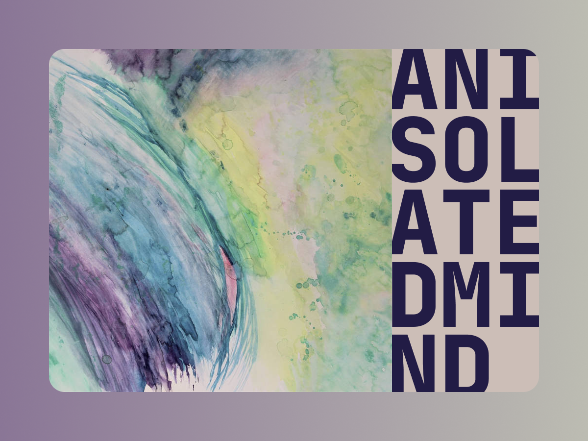

# I'm Losing Myself
## By AN ISOLATED MIND

You will be told that this album was created by one person by the name of Kameron Bogges, but I know the truth. This album is a chimera. This album exists only because mankind has pushed it, howling and bleeding and unformed, from an unclassifiable world into our own limited spectrum. Still dripping with the viscera of the unexplored, I'm Losing Myself's every move is a majesty of musical magnificence.

Throughout its 56 minutes and 42 seconds, I heard familiar sound layered upon familiar sound layered upon dear god what is that thing.

----- embed -----

After I was drawn closer by We Are Fragile Vibrations' waves of euphonious color, I chose to join its human perimeter, gazing awe-struck by its radiance, but distant from the epicenter (lest I become unmade by hubris). I was immediately rewarded by a heart-swell of unimaginable magnitude! The deep of my insides, where I had not dared explore, came bursting forth, invisible, yet extra-tangible, aching and yearning for something we have yet to be provided in this existence. A direct channel to something other, something between, something else. As the spectacle of I've Lost Myself ended, I found myself catching my breath (and maybe someone else's) as the mantle of mundanity returned to my wanting form. Every subsequent listen provided more and more that I desired to classify. Could I capture the signal that I first bore witness to all those...hours?…weeks?...months? ago? Could I hold it again?

Conquering my own vulnerability I stitched up the extra-dimensional harbor that has since become dark and immaterial.

How can I move forward otherwise? A coagulated port of fancy whose import I had willingly codified. Closing it was necessary. After all, I need my hands to grasp, and I need my strength to speak. But know this, earful readers. I DID once experience the unexperiencable. And if it's possible once...maybe it is possible again.

As always, take my words with a grain of salt, do your own research, and be careful.

-Kevin